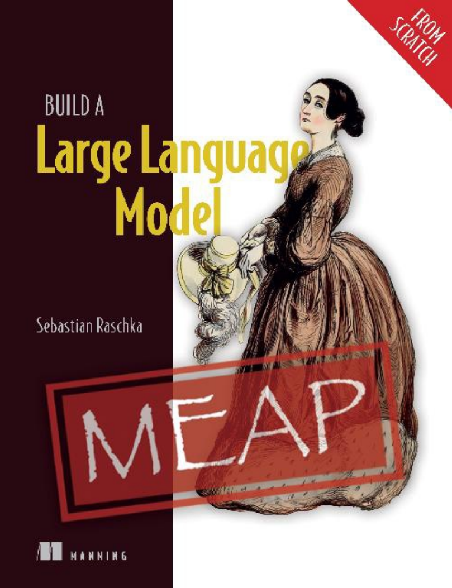
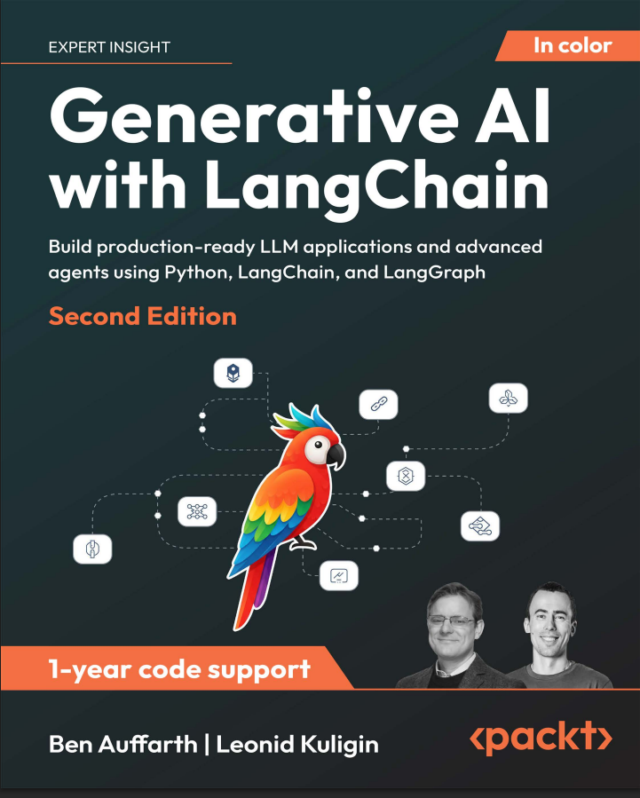
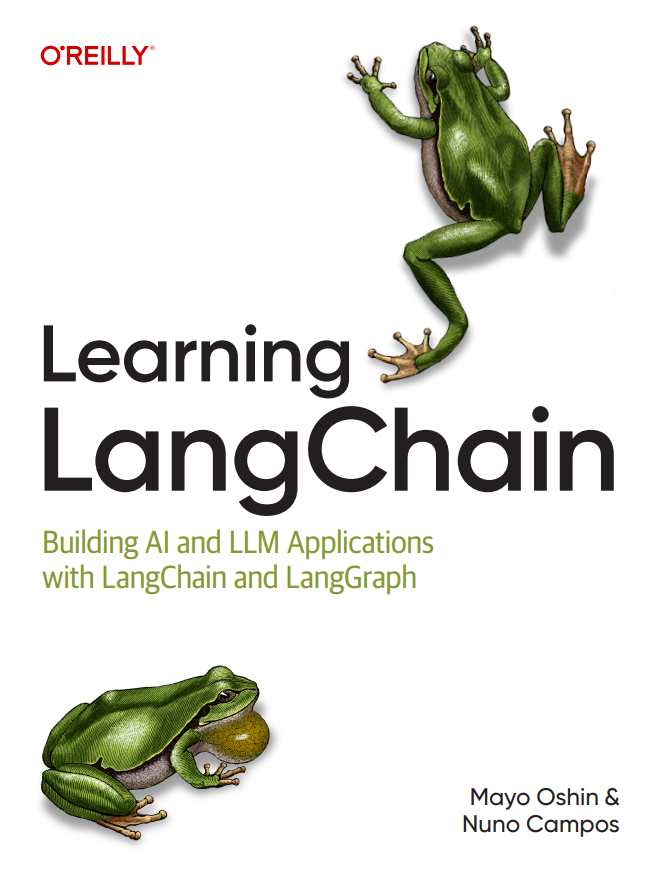

# ai — RAG & LangGraph

A compact repository for learning retrieval‑augmented generation (RAG) and multi‑agent AI workflows using LangGraph. Code is handcrafted and used for experimenting with real examples and tests — no AI‑generated code is included.

Books / references used (images in-line):

<table>
  <tr>
    <td></td>
    <td></td>
    <td></td>
  </tr>
</table>

Short notes
- Examples demonstrate state‑driven agents, vector store usage, and small runnable graphs.
- See `langgraph_agents/` for agent examples and `rag/` for RAG utilities.
- Environment: set OPENAI_API_KEY in a .env file and run examples directly.